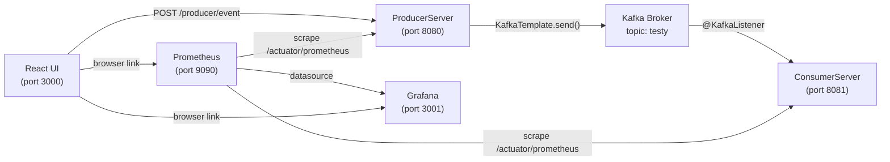
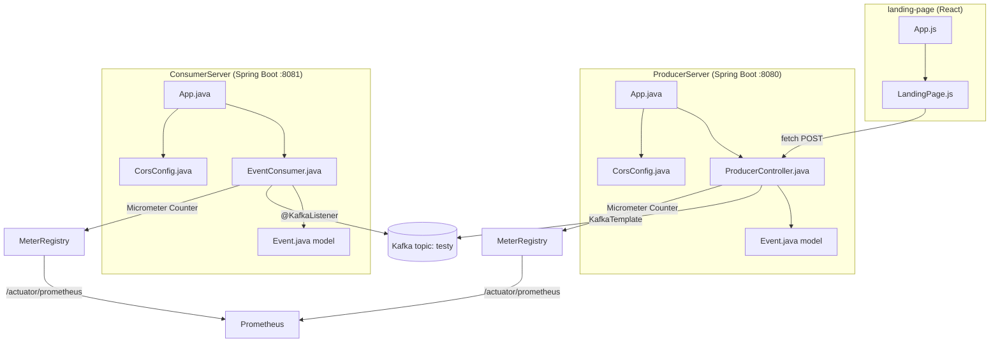
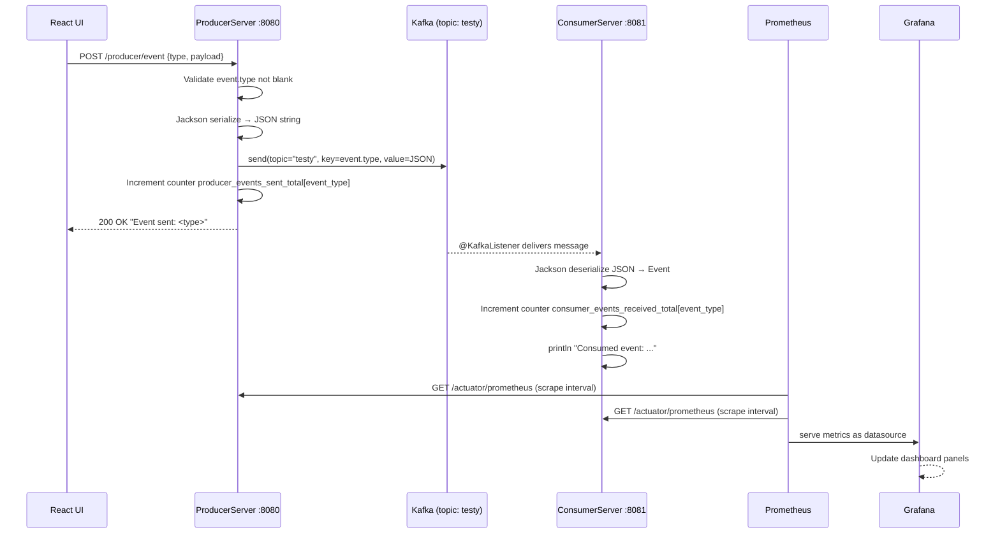

# Architecture

## High-Level Overview

```
┌─────────────────────────────────────────────────────────────────────┐
│                          Developer Machine                          │
│                                                                     │
│  ┌──────────────┐   HTTP POST    ┌──────────────────┐              │
│  │  React UI    │ ─────────────► │  ProducerServer  │              │
│  │ (port 3000)  │                │  (port 8080)      │              │
│  └──────────────┘                └────────┬─────────┘              │
│                                           │ KafkaTemplate.send()   │
│                                           ▼                        │
│                                  ┌──────────────────┐              │
│                                  │   Apache Kafka   │              │
│                                  │  topic: "testy"  │              │
│                                  │ 172.24.236.246   │              │
│                                  │    port 9092     │              │
│                                  └────────┬─────────┘              │
│                                           │ @KafkaListener         │
│                                           ▼                        │
│                                  ┌──────────────────┐              │
│                                  │  ConsumerServer  │              │
│                                  │  (port 8081)     │              │
│                                  └──────────────────┘              │
│                                                                     │
│  ┌────────────────┐   scrape /actuator/prometheus                  │
│  │   Prometheus   │ ──────────────────────────────► :8080 & :8081  │
│  │  (port 9090)   │                                                 │
│  └───────┬────────┘                                                 │
│          │ datasource                                               │
│          ▼                                                          │
│  ┌────────────────┐                                                 │
│  │    Grafana     │                                                 │
│  │  (port 3001)   │◄── browser navigates here from React footer    │
│  └────────────────┘                                                 │
└─────────────────────────────────────────────────────────────────────┘
```

---

## Mermaid — High-Level Architecture



---

## Mermaid — Component Diagram



---

## Mermaid — Event Flow



---

## Architectural Patterns

| Pattern | Where Used | Why |
|---|---|---|
| **Event-Driven Architecture** | Kafka producer/consumer | Decouples event creation from processing; consumer can be scaled or replaced without changing producer |
| **Microservices** | Two separate Spring Boot apps | Each service owns its responsibility; can be deployed, scaled, and updated independently |
| **Dependency Injection** | Spring `@Autowired` via constructor | Testability; Spring manages object lifecycle |
| **MVC (partial)** | ProducerServer: Controller + Model | Standard REST controller pattern |
| **Singleton** | MeterRegistry, KafkaTemplate | Spring manages these as beans; one instance per application context |
| **Observer (via Kafka)** | ConsumerServer @KafkaListener | Consumer is notified when producer publishes; no polling |
| **CORS Filter** | CorsConfig in both servers | Security boundary: restricts cross-origin HTTP |

---

## Folder Structure

```
Kafka Mini Proj/
├── ProducerServer/                  # Spring Boot REST + Kafka producer
│   ├── app/
│   │   ├── build.gradle             # dependencies: spring-web, kafka, actuator, micrometer-prometheus
│   │   └── src/main/java/org/example/
│   │       ├── App.java             # @SpringBootApplication entry point
│   │       ├── config/
│   │       │   └── CorsConfig.java  # CORS filter bean
│   │       ├── controller/
│   │       │   └── ProducerController.java  # POST /producer/event
│   │       └── model/
│   │           └── Event.java       # POJO: type + payload
│   │   └── src/main/resources/
│   │       └── application.properties   # port 8080, kafka config, actuator
│   ├── gradle/libs.versions.toml    # version catalog (guava, junit)
│   └── settings.gradle              # root project name, includes 'app'
│
├── ConsumerServer/                  # Spring Boot Kafka consumer + metrics
│   ├── build.gradle                 # dependencies: spring-web, kafka, actuator, micrometer
│   └── src/main/java/org/example/
│       ├── App.java                 # @SpringBootApplication entry point
│       ├── config/
│       │   └── CorsConfig.java      # identical CORS filter
│       ├── consumer/
│       │   └── EventConsumer.java   # @KafkaListener on topic "testy"
│       └── model/
│           └── Event.java           # identical POJO
│       └── src/main/resources/
│           └── application.properties   # port 8081, kafka config, consumer group
│
└── landing-page/                    # React CRA frontend
    ├── package.json                 # React 18, react-scripts 5
    └── src/
        ├── App.js                   # root component → LandingPage
        ├── LandingPage.js           # event buttons, fetch calls, counters
        └── LandingPage.css          # dark-theme grid layout
```
