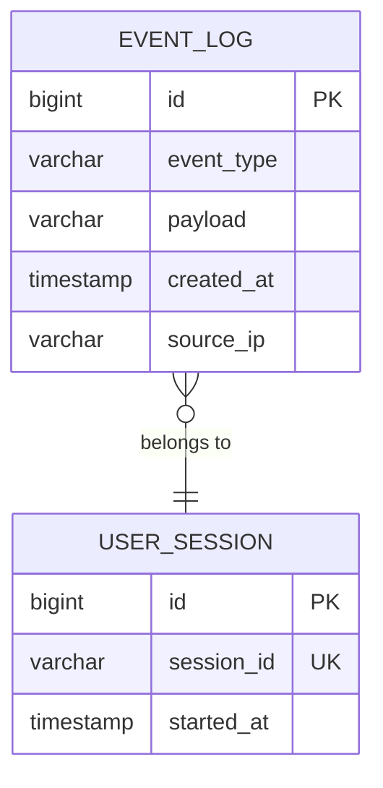

# Database

## Current State

**This project has no active database.** There are zero JPA entities, zero SQL migration files, zero Spring Data repositories, and zero database schema definitions in the codebase.

However, the ProducerServer `build.gradle` includes the MySQL driver dependency:

```groovy
// ProducerServer/app/build.gradle line 35
implementation group: 'mysql', name: 'mysql-connector-java', version: '8.0.33'
```

This is a **dead dependency** — it is declared but never used. No `spring.datasource.*` properties exist in `application.properties`, no JPA/Hibernate auto-config is triggered, and Spring Boot skips DataSource auto-configuration when no datasource URL is present.

---

## Persistence Model (As Built)

All state is **ephemeral and in-memory**:

| What | Where | Durability |
|---|---|---|
| Event counts | React `useState` hook in LandingPage.js | Lost on page refresh |
| Kafka messages | Kafka topic "testy" on the broker | Durable until topic retention expires |
| Micrometer metrics | In-memory MeterRegistry | Lost on JVM restart |
| Prometheus time-series | Prometheus local TSDB (external) | Durable per Prometheus config |

---

## What a Production Version Would Add



A production extension might:
1. Persist raw events to MySQL/PostgreSQL from the ConsumerServer (audit log).
2. Store aggregated counts to a time-series DB (InfluxDB, TimescaleDB).
3. Use Spring Data JPA with `@Entity` and `JpaRepository`.

---

## Why No Database Was Needed

The goal of this project is to demonstrate the **streaming pipeline**, not persistence. Prometheus serves as the time-series store for metrics, making a traditional database unnecessary for the observability use case.
