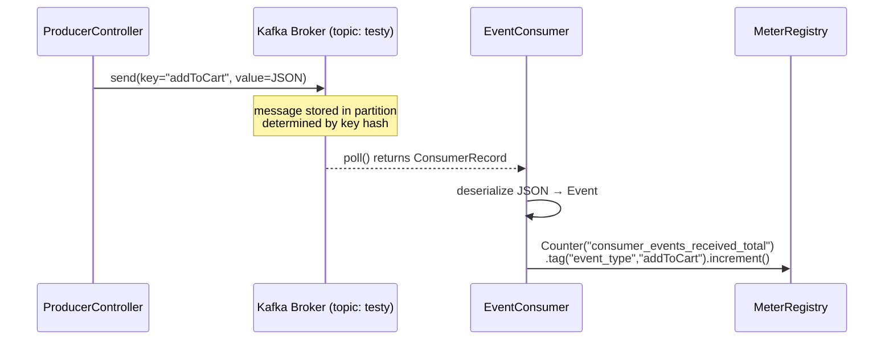

# Messaging

## Technology: Apache Kafka

Kafka is the message broker that decouples the ProducerServer from the ConsumerServer.

### Why Kafka (vs. RabbitMQ / SQS / Redis PubSub)?

| Criteria | Kafka | RabbitMQ |
|---|---|---|
| Message retention | Configurable (log-based) | Messages deleted after ACK |
| Multiple consumers | Fan-out natively (consumer groups) | Requires exchange bindings |
| Ordering guarantee | Per-partition, per-key | Per-queue |
| Replay capability | Yes (offset reset) | No |
| Throughput | Very high | Moderate |

For an analytics pipeline where you may want to **replay** events or add new consumers later (e.g., a database writer, an ML pipeline), Kafka is the natural choice.

---

## Topic Configuration

| Property | Value |
|---|---|
| Topic name | `testy` |
| Broker address | `172.24.236.246:9092` |
| Key serializer | `StringSerializer` |
| Value serializer | `StringSerializer` |
| Consumer group | `metrics-consumer-group` |
| Auto offset reset | `earliest` |

**`auto-offset-reset=earliest`** means: when the consumer group starts for the first time (no committed offset exists), it reads from the very beginning of the topic. This ensures no events are missed on first startup.

---

## Producer Configuration

**File:** `ProducerServer/app/src/main/resources/application.properties`

```properties
spring.kafka.bootstrap-servers=172.24.236.246:9092
spring.kafka.producer.key-serializer=org.apache.kafka.common.serialization.StringSerializer
spring.kafka.producer.value-serializer=org.apache.kafka.common.serialization.StringSerializer
```

Spring Boot auto-configures a `KafkaTemplate<String, String>` bean from these properties. The `ProducerController` receives this via constructor injection.

**Sending a message:**
```java
// ProducerController.java line 36
kafkaTemplate.send(TOPIC_NAME, event.getType(), payload);
//                 ^^topic     ^^key            ^^value
```

- `TOPIC_NAME = "testy"` (constant, line 15)
- Key = `event.getType()` — routes events of the same type to the same partition
- Value = JSON string of the full Event object

---

## Consumer Configuration

**File:** `ConsumerServer/src/main/resources/application.properties`

```properties
spring.kafka.bootstrap-servers=172.24.236.246:9092
spring.kafka.consumer.group-id=metrics-consumer-group
spring.kafka.consumer.auto-offset-reset=earliest
spring.kafka.consumer.key-deserializer=org.apache.kafka.common.serialization.StringDeserializer
spring.kafka.consumer.value-deserializer=org.apache.kafka.common.serialization.StringDeserializer
```

**Listener:**
```java
// EventConsumer.java line 21
@KafkaListener(topics = "testy", groupId = "metrics-consumer-group")
public void consume(String message) { ... }
```

Spring Kafka creates a `ConcurrentMessageListenerContainer` that polls the broker on a background thread. When a message arrives, `consume()` is called with the raw string value.

---

## Message Format

**Kafka Message on topic "testy":**

```
Key:   addToCart
Value: {"type":"addToCart","payload":"react-ui"}
```

The value is the JSON serialization of the `Event` POJO, produced by:
```java
String payload = objectMapper.writeValueAsString(event);
```

And deserialized on the consumer side by:
```java
Event event = objectMapper.readValue(message, Event.class);
```

---

## Event Types

| Event Type | Description | Emitted From |
|---|---|---|
| `pageView` | User visited the page | React UI button |
| `userClick` | User clicked a course / buy button | React UI button |
| `addToCart` | User added a course to cart | React UI button |
| `checkout` | User completed a purchase | React UI button |

These are simulated in the UI — there is no real cart or purchase flow.

---

## Mermaid — Event Flow Diagram



---

## Error Handling and Retry

### Current Implementation (Minimal)

**Producer side:** Errors from `kafkaTemplate.send()` are caught by the outer `try/catch` in `ProducerController.sendEvent()`. However, `kafkaTemplate.send()` is non-blocking and returns a `CompletableFuture` — the current code does **not** call `.get()` or add a callback, meaning Kafka delivery failures are silently dropped.

**Consumer side:** The `catch` block in `EventConsumer.consume()` logs the error to stderr and increments `consumer_events_failed_total`. The message is then **acknowledged** (committed) to Kafka — it is NOT retried. This means malformed messages are discarded.

### What a Production Version Would Add

1. **Producer:** Use `kafkaTemplate.send(record).whenComplete((result, ex) -> { ... })` to handle delivery failures.
2. **Consumer:** Configure `spring.kafka.listener.ack-mode=manual` and only commit offset after successful processing.
3. **Dead Letter Topic (DLT):** Use `@RetryableTopic` or `DeadLetterPublishingRecoverer` to route failed messages to `testy.DLT` after N retries.
4. **Idempotent producer:** Set `spring.kafka.producer.properties.enable.idempotence=true` to prevent duplicate messages on retries.

---

## Partition Strategy

With a single topic `testy` and the event type as key, Kafka routes:
- All `pageView` events → Partition X
- All `checkout` events → Partition Y

This guarantees **per-event-type ordering** — if you had a consumer that tracks sequential state per event type, this design supports it.
