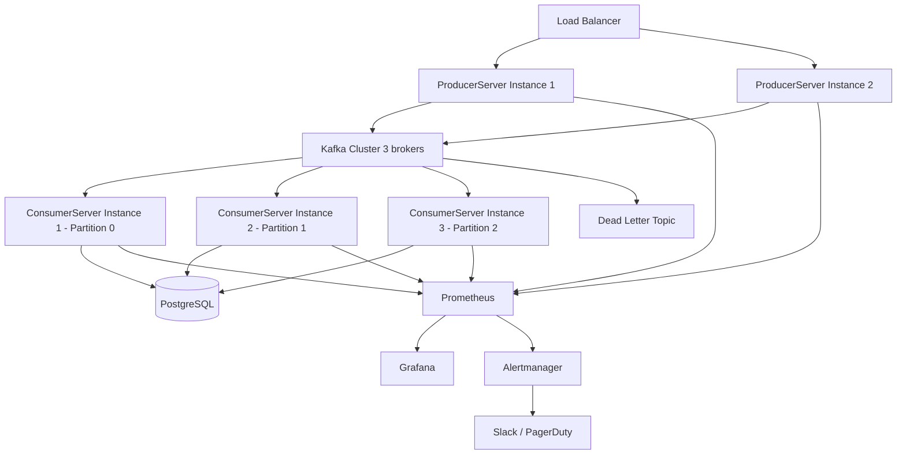

# Production Readiness Review

## Overall Assessment: Development / Learning Project

This system is **not production-ready**. It is an excellent learning scaffold demonstrating the integration of Spring Boot + Kafka + Prometheus + Grafana, but several critical gaps must be addressed before deployment.

---

## Strengths

| Strength | Detail |
|---|---|
| **Separation of concerns** | Producer and Consumer are independent services; neither knows about the other |
| **Metrics from day one** | Micrometer counters are already tagged by event type — easy to build Grafana dashboards |
| **Dimensional metrics** | `event_type` tag allows per-type breakdown without separate metric names |
| **Offset reset strategy** | `auto-offset-reset=earliest` ensures no events are missed on consumer restart |
| **Validation exists** | ProducerController validates non-blank event type before publishing |
| **Clean code** | Small, readable classes; single responsibility per class |
| **Java 21** | Modern LTS, compatible with Spring Boot 3.x virtual threads if needed |

---

## Weaknesses / Gaps

### Reliability

| Gap | Risk | Fix |
|---|---|---|
| `kafkaTemplate.send()` future not awaited | Producer returns 200 even if Kafka is down | Add `.whenComplete()` callback or call `.get()` with timeout |
| Consumer swallows bad messages | Failed deserialization silently discards data | Implement Dead Letter Topic with `@RetryableTopic` |
| No health check for Kafka | Service appears healthy even when disconnected from broker | Add Kafka health indicator (already available via `spring-boot-starter-actuator` + `spring-kafka`) |
| No retry on consumer | One parse failure = message lost | Configure retry with backoff |
| In-memory metrics only | Metrics reset on restart | Already solved by Prometheus TSDB — counters restart from 0 but Prometheus tracks rate |

### Scalability

| Gap | Risk | Fix |
|---|---|---|
| Single Kafka partition by default | All events serialized through one partition | Create topic with `--partitions 3` (or more) |
| Single consumer instance | Throughput bottleneck; no parallelism | Run multiple ConsumerServer instances in same consumer group (each gets a partition) |
| No connection pooling | Each HTTP request creates potential overhead | Spring's embedded Tomcat handles this, but Kafka producer is shared correctly via `KafkaTemplate` singleton |

### Observability

| Gap | Risk | Fix |
|---|---|---|
| `System.out.println` for logging | No log levels, no structured logs, no log aggregation | Replace with SLF4J + Logback, output JSON for ELK/CloudWatch |
| No distributed tracing | Cannot trace a single event through producer → Kafka → consumer | Add Micrometer Tracing (Zipkin/Jaeger) |
| No alerting rules | Nobody is notified when consumer lag grows | Define Prometheus alerting rules + Alertmanager |
| No Grafana dashboard IaC | Dashboard config is manual and will be lost | Export dashboard JSON to version control |

### Security (see SECURITY.md for full detail)

- No authentication on the REST API
- Hardcoded Kafka broker IP
- All Actuator endpoints exposed
- No TLS

### Operational

| Gap | Risk | Fix |
|---|---|---|
| No Docker Compose | Hard to onboard; requires manual service setup | Write `docker-compose.yml` for all services |
| No CI/CD | No automated tests or deployments | Add GitHub Actions with `./gradlew test` |
| Broken unit test | `AppTest.java` calls `getGreeting()` which doesn't exist | Delete or fix the test |
| Dead dependencies | Lombok (declared, unused), MySQL driver (declared, unused) | Remove from `build.gradle` |
| No graceful shutdown | JVM kill during processing could lose in-flight events | Configure `server.shutdown=graceful` and consumer commit-on-close |
| No liveness/readiness probes | Container orchestrators can't determine app state | Configure Kubernetes liveness/readiness via Actuator health groups |

---

## Recommended Improvements (Prioritized)

### Priority 1 — Correctness
1. Await `kafkaTemplate.send()` or add failure callback.
2. Implement Dead Letter Topic for failed consumer messages.
3. Fix the CORS origin to include `http://localhost:3000`.
4. Fix or remove `AppTest.java`.

### Priority 2 — Operability
5. Replace `System.out.println` with SLF4J logging.
6. Add `docker-compose.yml` for one-command startup.
7. Externalize Kafka bootstrap servers to environment variable.
8. Remove unused dependencies (Lombok, MySQL, Guava in ProducerServer).

### Priority 3 — Security
9. Add API key or JWT authentication.
10. Restrict Actuator endpoints.
11. Add Bean Validation to Event model.

### Priority 4 — Scalability
12. Create topic with 3+ partitions.
13. Add consumer lag monitoring in Prometheus.
14. Enable virtual threads: `spring.threads.virtual.enabled=true` (Spring Boot 3.2 + Java 21).

---

## Production Architecture (What This Would Look Like at Scale)

